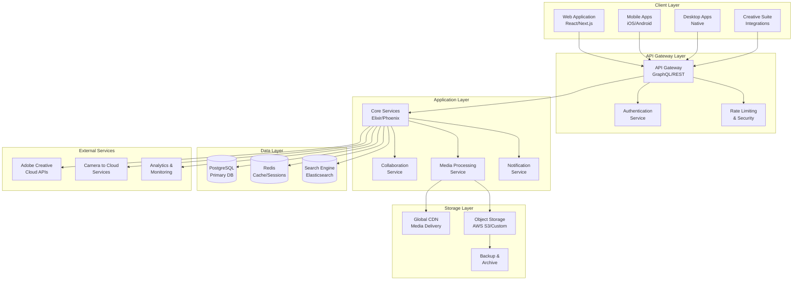
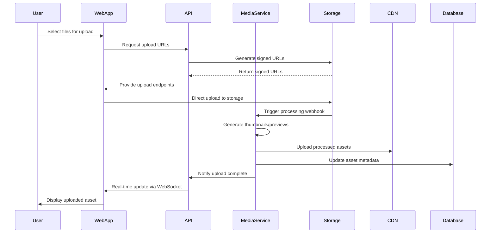
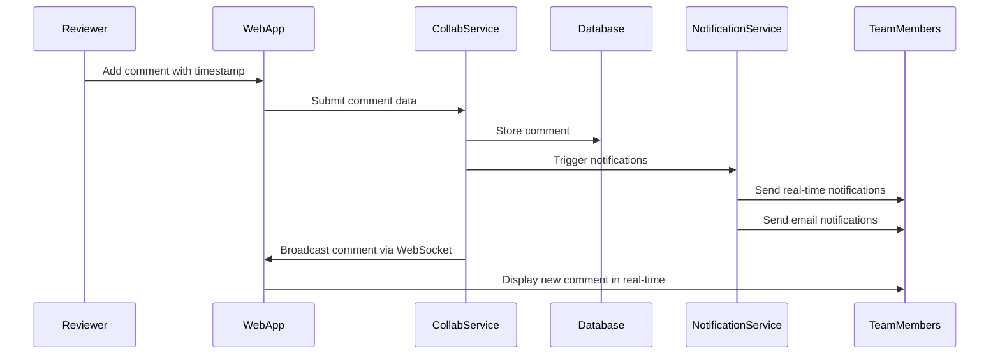
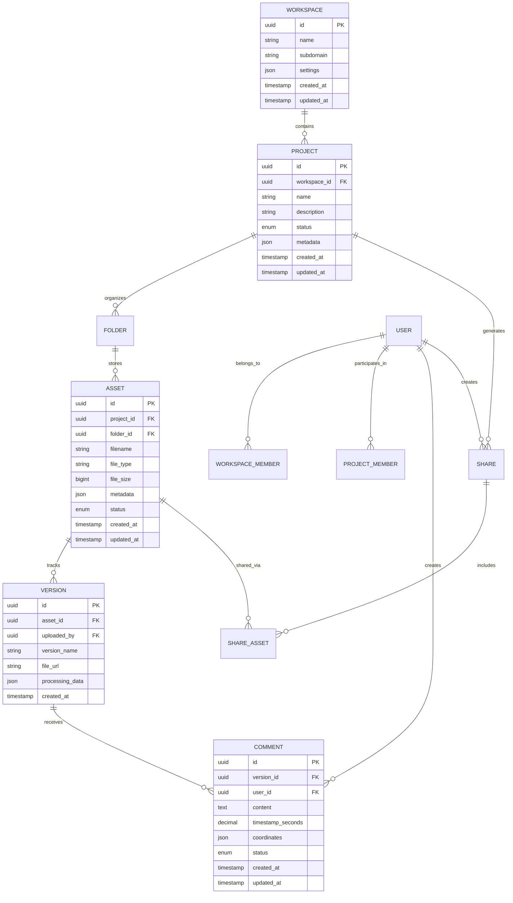
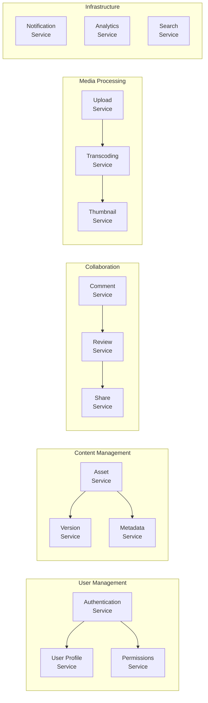
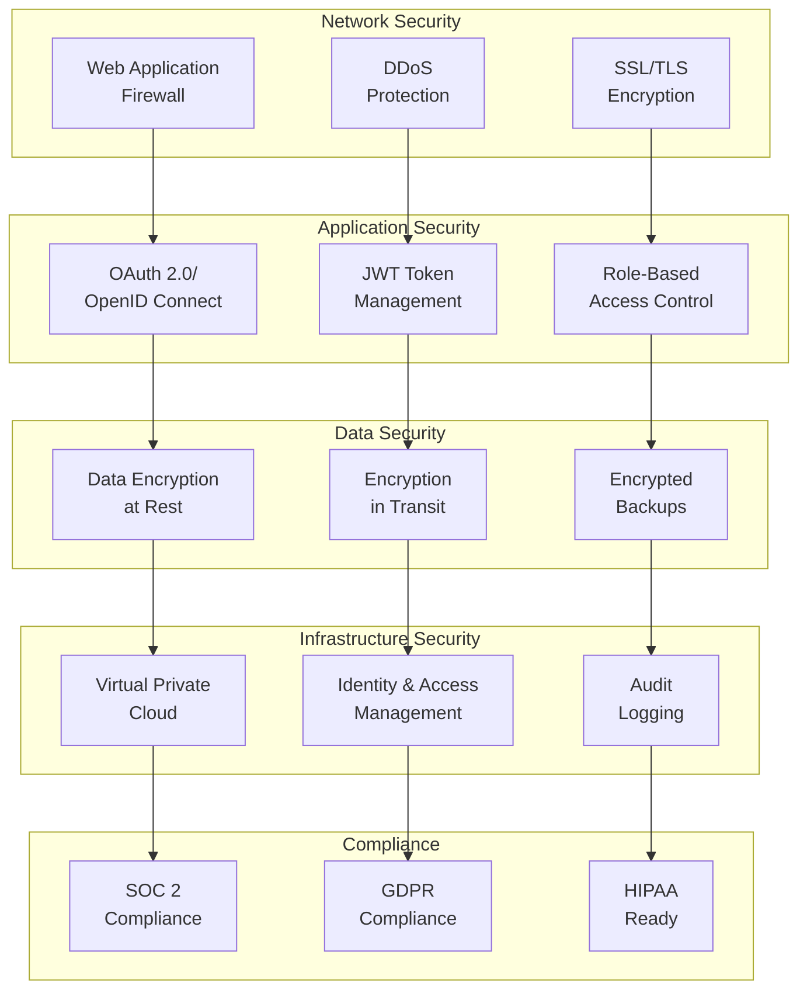
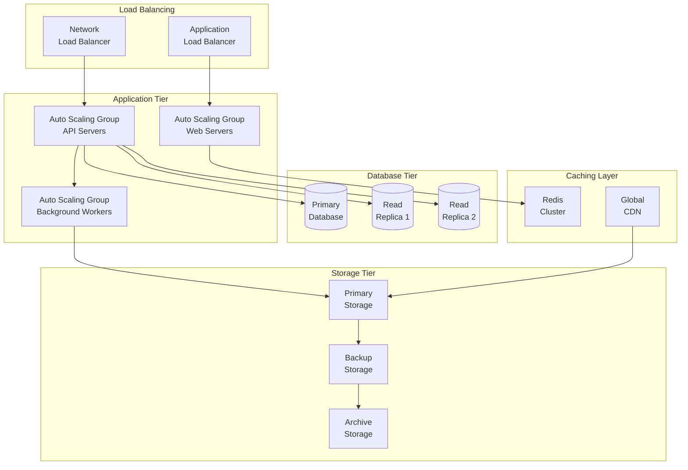
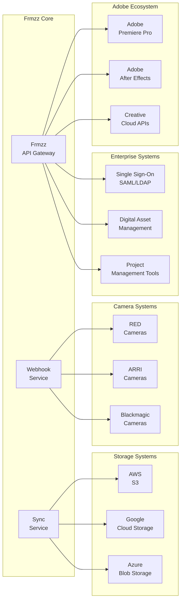
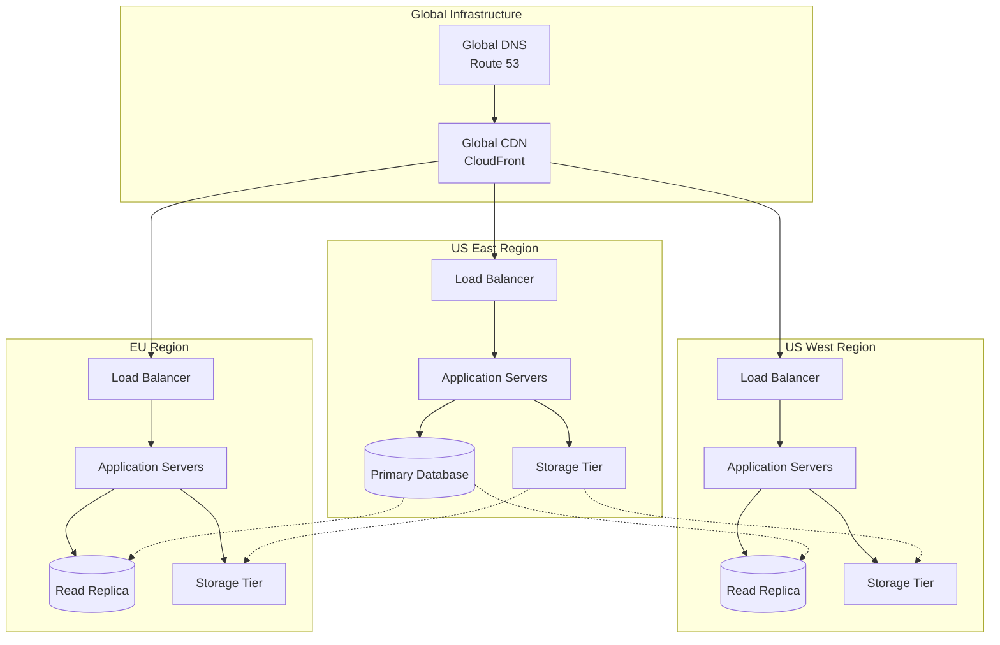

# Frmzz Product Requirements Document (PRD)

**Document Version:** 1.0  
**Date:** June 11, 2025  
**Author:** Manus AI  
**Document Type:** Comprehensive Product Analysis and Requirements

---

## Executive Summary

Frmzz represents a paradigm shift in creative collaboration technology, positioning itself as the definitive cloud-based platform for video production workflows. This comprehensive Product Requirements Document provides an exhaustive analysis of Frmzz's product architecture, user experience design, technical implementation, and market positioning based on extensive research and interface analysis.

Frmzz has established itself as a leading solution for video review and collaboration, serving creative professionals ranging from individual creators to enterprise organizations. The platform's distinctive black and pink visual identity creates a modern, professional environment optimized for video content, while its sophisticated feature set addresses the complex requirements of professional video production workflows.

The platform's core value proposition centers on eliminating the friction inherent in traditional video production workflows. By providing a centralized hub for asset management, real-time collaboration, and structured review processes, Frmzz addresses the fundamental challenges that have historically plagued creative teams: version control chaos, inefficient feedback loops, and the complexity of managing large media files across distributed teams.

This document serves as both a comprehensive analysis of Frmzz's current product offering and a blueprint for understanding the sophisticated technical and design decisions that enable the platform to serve the demanding requirements of professional video production. The analysis encompasses detailed examination of user interface components, technical architecture, information hierarchy, and the design system that creates a cohesive and professional user experience.

## Product Overview and Market Position

Frmzz operates within the rapidly expanding creative collaboration software market, addressing the specific needs of video production professionals who require sophisticated tools for managing large media files, coordinating complex review processes, and maintaining version control across multiple stakeholders. The platform distinguishes itself from generic file sharing solutions by providing purpose-built features for video workflows, including frame-accurate commenting, real-time collaboration, and integration with professional video editing software.

The product's market positioning reflects a deep understanding of the video production industry's unique challenges. Unlike traditional project management tools or basic file sharing platforms, Frmzz recognizes that video production involves highly specialized workflows where timing, visual accuracy, and collaborative feedback are paramount. The platform's design philosophy prioritizes the needs of creative professionals who work with large files, tight deadlines, and complex approval processes.

Frmzz's user base spans the entire spectrum of video production, from independent filmmakers working on personal projects to major studios managing multi-million dollar productions. This broad market appeal is achieved through a carefully structured pricing model that scales from free individual accounts to enterprise solutions with advanced security and administrative features. The platform's ability to serve both ends of this spectrum while maintaining a consistent user experience demonstrates sophisticated product design and technical architecture.

The competitive landscape includes both specialized video collaboration tools and broader creative project management platforms. However, Frmzz's focus on video-specific workflows, combined with its integration capabilities and professional-grade features, has enabled it to capture significant market share and establish itself as a leading standard for video collaboration. The platform's distinctive visual identity, with its black background and pink accent colors, creates immediate brand recognition while providing an optimal environment for video content review.

## Target User Analysis and Personas

Frmzz's success stems from its deep understanding of diverse user personas within the video production ecosystem. The platform serves three primary user categories, each with distinct needs, workflows, and technical requirements.

### Individual Creators and Freelancers

Individual creators represent the entry point into Frmzz's ecosystem, typically consisting of freelance videographers, independent filmmakers, content creators, and small production companies. These users prioritize ease of use, cost-effectiveness, and the ability to present their work professionally to clients. Their workflows often involve working alone or with small teams, requiring basic collaboration features and client review capabilities.

For individual creators, Frmzz provides essential tools for organizing personal projects, sharing work with clients for feedback, and maintaining a professional presentation. The platform's free tier serves as an effective onboarding mechanism, allowing users to experience the core functionality before committing to paid plans. The interface design accommodates users who may not have extensive technical expertise while providing sufficient functionality for professional work.

The individual creator persona values simplicity without sacrificing professional capabilities. They need tools that help them compete with larger production companies by providing professional-grade collaboration features that enhance their service offering to clients. Frmzz's client review features, branded sharing options, and organized project presentation capabilities directly address these needs.

### Professional Teams and Production Companies

Professional teams represent Frmzz's core user base, consisting of production companies, post-production facilities, marketing agencies, and corporate video teams. These users require advanced workflow management, sophisticated collaboration features, and integration with professional video editing software. Their projects typically involve multiple team members, complex approval processes, and tight deadlines.

Professional teams utilize Frmzz's advanced features including custom workflows, detailed permission management, integration with editing software, and comprehensive project organization tools. These users demand reliability, performance, and features that can handle the complexity of professional video production. They often work with large files, multiple versions, and require frame-accurate feedback capabilities.

The professional team persona values efficiency, reliability, and advanced functionality. They need tools that can streamline complex workflows, reduce the time spent on administrative tasks, and provide clear visibility into project status and team activity. Frmzz's project management features, advanced commenting system, and integration capabilities directly serve these requirements.

### Enterprise Organizations

Enterprise users represent the highest tier of Frmzz's market, consisting of large corporations, major studios, broadcasting companies, and organizations with complex security and compliance requirements. These users require advanced administrative controls, enterprise-grade security, custom integrations, and the ability to manage multiple teams and projects at scale.

Enterprise organizations utilize Frmzz's most sophisticated features including workspace management, advanced security controls, custom storage integration, and comprehensive administrative tools. These users often have specific compliance requirements, need detailed usage analytics, and require the ability to integrate Frmzz with existing enterprise systems and workflows.

The enterprise persona values security, scalability, and administrative control. They need tools that can integrate with existing enterprise infrastructure, provide detailed audit trails, and offer the flexibility to customize the platform to meet specific organizational requirements. Frmzz's enterprise features, including SSO integration, custom storage options, and advanced administrative controls, directly address these needs.

## Feature Analysis and Functional Requirements

Frmzz's feature set represents a comprehensive solution for video collaboration, encompassing six primary functional areas that address the complete lifecycle of video production projects. Each feature category has been carefully designed to integrate with the others, creating a cohesive workflow that eliminates the need for multiple disparate tools.

### Workflow Management Capabilities

Workflow Management serves as the foundation of Frmzz's value proposition, providing tools for organizing projects, managing team collaboration, and automating routine tasks. The platform recognizes that video production involves complex, multi-stage processes that require careful coordination between multiple stakeholders with different roles and responsibilities.

The workflow management system enables users to create custom project structures that reflect their specific production methodologies. Projects can be organized hierarchically with folders, episodes, and custom categorizations that match the user's mental model of their work. This organizational flexibility accommodates diverse production styles, from traditional film production with clearly defined phases to agile content creation workflows that require rapid iteration.

Team collaboration features within the workflow management system provide sophisticated tools for coordinating work across distributed teams. Users can assign specific roles and permissions to team members, ensuring that each person has appropriate access to relevant assets while maintaining security and version control. The system tracks all team activity, providing visibility into who is working on what and when changes are made.

Automation capabilities reduce the administrative burden of managing complex projects by automatically triggering actions based on predefined rules. For example, the system can automatically notify relevant team members when new assets are uploaded, when comments are added, or when approval milestones are reached. These automation features help ensure that projects maintain momentum and that important communications don't fall through the cracks.

The workflow management system also provides comprehensive project tracking and reporting capabilities. Users can monitor project progress, track time spent on different phases, and generate reports that provide insights into team productivity and project efficiency. These analytics capabilities are particularly valuable for professional teams and enterprise organizations that need to optimize their workflows and demonstrate value to clients or stakeholders.

### File Management and Asset Organization

File Management represents one of Frmzz's most sophisticated feature areas, addressing the unique challenges of working with large video files, multiple versions, and complex asset relationships. The platform's approach to file management goes far beyond simple storage, providing intelligent organization, powerful search capabilities, and automated processing that enhances the usability of uploaded content.

The asset organization system provides multiple methods for categorizing and finding content, recognizing that different users have different mental models for organizing their work. Users can organize assets by project, by type, by status, or by custom categories that reflect their specific workflow requirements. The system supports both hierarchical folder structures and tag-based organization, allowing users to choose the approach that best fits their working style.

Version control capabilities address one of the most persistent challenges in video production: managing multiple iterations of the same asset. Frmzz automatically stacks related versions, making it easy to see the evolution of an asset over time while ensuring that team members are always working with the most current version. The version stacking system is intelligent enough to recognize related files based on naming conventions and metadata, reducing the manual effort required to maintain organization.

Search and discovery features provide powerful tools for finding specific assets within large projects. The system indexes not only file names and metadata but also automatically generated information such as video duration, resolution, and technical specifications. Users can search by any combination of criteria, making it easy to find specific assets even in projects with thousands of files.

Automated processing capabilities enhance the value of uploaded assets by automatically generating thumbnails, previews, and technical metadata. This processing happens in the background, ensuring that assets are immediately usable for review and collaboration without requiring manual intervention. The system can handle a wide variety of file formats, automatically converting them to web-friendly formats for online viewing while preserving the original files for download.

### Share and Present Functionality

Share and Present features enable Frmzz users to extend collaboration beyond their immediate team, providing secure and professional tools for sharing work with clients, stakeholders, and external collaborators. These features recognize that video production often involves multiple rounds of external review and approval, requiring tools that are both secure and easy to use for non-technical users.

The sharing system provides granular control over access permissions, allowing users to specify exactly what each recipient can see and do. Shares can be configured to allow viewing only, commenting, or downloading, with additional options for password protection and expiration dates. This flexibility ensures that users can share their work confidently while maintaining appropriate security controls.

Presentation features provide professional tools for showcasing work to clients and stakeholders. The platform's presentation interface is designed to focus attention on the content while providing easy access to collaboration features. Users can create branded presentations that reflect their professional identity, enhancing the client experience and reinforcing their brand.

External collaboration capabilities enable non-Frmzz users to participate in the review process without requiring them to create accounts or learn new software. External collaborators can view assets, add comments, and participate in approval workflows using only a web browser. This accessibility is crucial for maintaining project momentum when working with clients or stakeholders who may not be familiar with video production tools.

Download and delivery features provide flexible options for distributing final assets. Users can control which versions are available for download, provide multiple format options, and track who has accessed or downloaded specific assets. These capabilities are essential for managing the final delivery phase of video projects while maintaining security and audit trails.

### Review and Approval Workflows

Review and Approval workflows represent Frmzz's most distinctive feature area, providing sophisticated tools for collecting, organizing, and acting on feedback throughout the video production process. These features address the reality that video production involves multiple rounds of review and revision, often with complex approval hierarchies and specific requirements for different types of feedback.

The commenting system provides frame-accurate feedback capabilities that are essential for video review. Users can add comments that are tied to specific moments in the video timeline, ensuring that feedback is precise and actionable. Comments can include text, drawings, and attachments, providing multiple ways to communicate specific changes or suggestions. The system maintains a complete history of all comments and responses, creating a comprehensive record of the review process.

Approval workflows provide structured processes for managing the progression from initial review to final approval. Users can define custom approval workflows that reflect their specific requirements, including multiple approval stages, required approvers, and conditional logic based on project type or content. The system tracks the status of each approval stage and automatically notifies relevant stakeholders when action is required.

Notification and communication features ensure that all team members stay informed about review activity and approval status. The system can send notifications via email, in-app alerts, or integration with external communication tools. Notifications are intelligent, providing relevant information without overwhelming users with unnecessary communications.

Review analytics provide insights into the review process, helping teams identify bottlenecks, track approval times, and optimize their workflows. These analytics are particularly valuable for professional teams and enterprise organizations that need to meet specific deadlines or demonstrate efficiency to clients.

### Mobile and Cross-Platform Access

Mobile and Cross-Platform Access features recognize that video production often involves work in diverse environments, from traditional office settings to remote locations where mobile access is essential. Frmzz's mobile applications provide core functionality optimized for mobile devices while maintaining integration with the broader platform ecosystem.

The iOS and iPad applications provide native mobile experiences that take advantage of device-specific capabilities. The iPad application is particularly sophisticated, providing a tablet-optimized interface that supports detailed review and collaboration activities. The iPhone application focuses on essential features like viewing, commenting, and uploading, optimized for quick access and communication.

Camera integration features enable direct upload from mobile devices and professional cameras, streamlining the process of getting content into the collaboration workflow. The Camera to Cloud functionality represents a particularly innovative feature, allowing professional cameras to upload content directly to Frmzz during filming, eliminating the traditional delay between capture and availability for review.

Offline capabilities ensure that users can continue working even when internet connectivity is limited. The mobile applications can cache content for offline viewing and queue uploads for when connectivity is restored. This functionality is essential for users who work in remote locations or travel frequently.

Cross-platform synchronization ensures that work done on mobile devices is immediately available on desktop and web platforms. Users can start a review on their mobile device and continue on their desktop without losing context or progress. This seamless synchronization is crucial for maintaining workflow continuity across different working environments.

### Integration and Extensibility

Integration and Extensibility features enable Frmzz to function as part of a broader creative technology ecosystem, recognizing that video production involves multiple specialized tools and that seamless integration is essential for efficient workflows. The platform provides both pre-built integrations with popular tools and APIs for custom integrations.

Adobe Creative Cloud integration represents the most sophisticated integration capability, providing deep connections with Premiere Pro, After Effects, and other Adobe applications. These integrations enable users to work directly with Frmzz assets within their editing software, upload directly from editing applications, and maintain synchronization between editing projects and Frmzz reviews. The integration is bidirectional, allowing changes made in either system to be reflected in the other.

Third-party integrations extend Frmzz's capabilities by connecting with project management tools, communication platforms, and other creative software. These integrations recognize that Frmzz is typically part of a larger toolkit and that seamless data flow between tools is essential for efficient workflows. The platform provides pre-built integrations with popular tools while also offering APIs for custom integrations.

API capabilities enable organizations to build custom integrations that meet their specific requirements. The Frmzz API provides comprehensive access to platform functionality, enabling developers to create custom workflows, integrate with proprietary systems, and build specialized tools that extend the platform's capabilities. The API is designed to be developer-friendly while maintaining the security and reliability required for professional use.

Storage integration features enable organizations to connect their own storage systems with Frmzz, providing flexibility for organizations with specific storage requirements or existing infrastructure investments. These integrations maintain Frmzz's collaboration and review capabilities while allowing organizations to maintain control over their data storage and management.


## User Interface and Experience Design

Frmzz's user interface represents a sophisticated balance between professional functionality and intuitive design, reflecting the platform's focus on serving creative professionals who require powerful tools without unnecessary complexity. The interface design prioritizes content visibility, efficient workflow, and clear communication, recognizing that the platform serves as a workspace for creative collaboration rather than a destination in itself.

### Design System and Visual Language

Frmzz employs a cohesive design system that creates visual consistency across the platform while providing clear affordances for different types of interactions. The design system establishes a professional aesthetic that aligns with the platform's positioning as an enterprise-grade creative tool.

The visual language is characterized by a black theme primary interface, which serves multiple practical purposes in the context of video production. The black background reduces eye strain during extended editing sessions, provides optimal contrast for viewing video content, and creates a professional environment that aligns with industry-standard video editing software. This design choice reflects a deep understanding of the platform's use context and user needs.

Typography throughout the interface employs a clean, modern sans-serif font family with careful attention to hierarchy and readability. Headings use larger sizes and bolder weights to establish clear information hierarchy, while body text maintains excellent readability even at smaller sizes. The typography system appears to use a limited set of sizes and weights, creating consistency while providing sufficient variation for different information types.

The color palette centers around a black primary background with off-white text, creating high contrast for optimal readability. Accent colors are used strategically to indicate interactive elements, status indicators, and categorical organization. The primary accent color is a bright pink/magenta tone (#FF0080) used for primary calls-to-action and important interactive elements. Secondary accent colors including blues, purples, and teals are used to differentiate feature categories and create visual interest without overwhelming the interface.

Iconography throughout the platform employs a consistent line-style approach with uniform stroke weights and simplified forms. Icons are used judiciously to enhance navigation and provide visual cues for different content types and actions. The icon system appears to be custom-designed for the platform, with specific attention to video-related concepts and actions that might not be available in standard icon libraries.

### Interface Layout and Organization

Frmzz's interface layout employs a sophisticated three-panel structure that has become standard in professional creative applications. This layout provides dedicated spaces for navigation, content display, and contextual information, allowing users to maintain awareness of their location within the platform while focusing on their current task.

The left sidebar serves as the primary navigation panel, providing hierarchical access to projects, assets, and organizational structures. This sidebar employs a collapsible design that can be expanded to show full text labels or collapsed to show only icons, accommodating different user preferences and screen sizes. The sidebar organization reflects the platform's information architecture, with clear visual distinction between different types of navigation elements.

The main content area occupies the majority of the screen space, providing maximum visibility for video content and assets. This area employs a responsive grid layout that adjusts based on content type and screen size, ensuring optimal display of different asset types. The content area includes sophisticated controls for sorting, filtering, and organizing assets, allowing users to customize their view based on their current task and preferences.

The right sidebar provides contextual information and tools related to the currently selected content. This area typically displays comments, metadata, and action tools that are relevant to the user's current focus. The right sidebar can be collapsed when not needed, providing additional space for content display while remaining easily accessible when required.

The interface includes a persistent header that provides global navigation, search functionality, and user account access. This header maintains consistent positioning across the platform, ensuring that users always have access to essential navigation and tools regardless of their current location within the application.

### Component Design and Interaction Patterns

Frmzz's component design demonstrates sophisticated attention to both aesthetic consistency and functional clarity. Each component type maintains consistent visual styling while providing clear affordances for its specific functionality, creating an interface that is both visually cohesive and functionally intuitive.

Button design employs clear visual hierarchy to indicate different levels of importance and functionality. Primary buttons use the platform's pink accent color with off-white text, creating high visibility for important actions. Secondary buttons use transparent backgrounds with borders, providing clear interactivity while maintaining visual subtlety. Text links use underlines or color changes to indicate interactivity, with consistent hover states that provide feedback on potential actions.

Form elements maintain consistent styling with clear focus states and validation feedback. Input fields use subtle dark gray backgrounds with clear borders to indicate interactivity, while dropdown menus and selection controls maintain consistent styling with the platform's overall aesthetic. Form validation provides clear feedback on errors or required fields, helping users complete forms accurately and efficiently.

Card components are used extensively for displaying assets and content items, providing consistent containers for different content types. Cards include thumbnails or previews, essential metadata, and contextual actions relevant to the specific content type. The card design balances information density with visual clarity, providing sufficient detail without overwhelming the interface.

Modal dialogs and overlays are used judiciously for focused tasks and confirmations, providing clear focus on specific actions while maintaining context awareness. These components use consistent entry and exit animations, clear visual separation from the underlying content, and explicit close mechanisms to ensure that users maintain control over their interface state.

The video player component represents one of the platform's most sophisticated interface elements, providing professional-grade playback controls, timeline navigation, and annotation capabilities. The player includes frame-accurate navigation, customizable playback speed, and integrated commenting functionality that ties feedback directly to specific moments in the video timeline.

### Responsive Design and Cross-Platform Consistency

Frmzz's interface demonstrates thoughtful responsive design that adapts to different screen sizes and device capabilities while maintaining functional consistency. The platform appears to employ a desktop-first approach that prioritizes professional workflows on larger screens while providing adapted experiences for smaller devices.

The desktop interface provides the most comprehensive functionality, with sophisticated multi-panel layouts and advanced tools for professional video workflows. This interface is optimized for precision work, with detailed controls and information displays that take advantage of larger screen real estate. The desktop experience appears to be the primary design target, reflecting the reality that most professional video work occurs on desktop or laptop computers.

Tablet interfaces, particularly on iPad, provide adapted layouts that maintain core functionality while optimizing for touch interaction and smaller screens. The iPad application appears to be a significant focus, with a dedicated app that provides a tailored experience for tablet users. This focus reflects the increasing importance of tablets in professional creative workflows, particularly for review and approval processes that may occur outside traditional office environments.

Mobile interfaces provide further adaptation for smartphone screens, focusing on essential viewing and communication functionality. The mobile experience prioritizes content consumption, basic commenting, and status tracking, recognizing that detailed editing and organization tasks are less likely to occur on smartphone devices. The mobile interface maintains visual consistency with the broader platform while providing appropriate adaptations for smaller screens and touch interaction.

Cross-platform consistency is maintained through shared design elements, consistent terminology, and synchronized data across all platforms. Users can move between different devices while maintaining a consistent mental model of the platform's organization and functionality. This consistency is essential for supporting distributed teams and flexible work environments where users may access the platform from multiple devices depending on their current context.

## Technical Architecture and Implementation

Frmzz's technical architecture represents a sophisticated approach to building a scalable, reliable platform capable of handling the demanding requirements of professional video production. The architecture employs modern cloud-native principles while incorporating specialized components designed specifically for media handling and real-time collaboration.

### Core Technology Stack

Frmzz's technology stack combines established enterprise technologies with specialized tools optimized for media processing and real-time collaboration. The stack appears to have evolved significantly as the platform has grown, reflecting a pragmatic approach to technology selection that prioritizes reliability, performance, and developer productivity.

The frontend architecture employs React as the primary UI framework, with Next.js providing server-side rendering capabilities that enhance performance and search engine visibility. TypeScript is used for type safety and improved developer experience, while state management is handled through a combination of Redux and MobX. This frontend stack represents current industry best practices for building complex, interactive web applications with sophisticated state management requirements.

The backend architecture appears to use Elixir with the Phoenix framework as a core technology, providing exceptional performance for real-time features and concurrent connections. This choice reflects the platform's focus on real-time collaboration and the need to handle thousands of simultaneous users interacting with shared content. The Elixir/Phoenix combination is particularly well-suited for applications that require high concurrency, low latency, and fault tolerance.

The API layer employs GraphQL as the primary query language, providing flexible and efficient data access for frontend applications. This approach allows clients to request exactly the data they need, reducing over-fetching and improving performance for bandwidth-constrained environments. The GraphQL implementation appears to be built on Apollo, providing sophisticated caching and real-time update capabilities.

Database technologies include PostgreSQL for primary data storage, providing a robust relational database with advanced features for complex data relationships and transactions. Redis is used for caching and session management, improving performance for frequently accessed data and supporting real-time features. Elasticsearch appears to be employed for search functionality, providing powerful full-text search capabilities across the platform's content.

### Media Processing and Delivery

Frmzz's media processing architecture represents one of the platform's most sophisticated technical components, handling the complex requirements of video processing, storage, and delivery at scale. This architecture must balance performance, quality, and cost considerations while providing a seamless experience for users working with large media files.

The upload architecture employs direct-to-storage uploads with signed URLs, allowing clients to upload files directly to cloud storage without routing through application servers. This approach improves upload performance and reliability while reducing server load. The upload process includes intelligent chunking and resumable uploads, ensuring that even large files can be uploaded reliably over unstable connections.

Transcoding and processing workflows handle the conversion of uploaded media into web-friendly formats for preview and review. These workflows appear to be implemented as serverless functions or background workers that process files asynchronously after upload. The processing pipeline generates multiple renditions of each video at different quality levels, optimized for different viewing contexts and bandwidth constraints.

Storage architecture employs a tiered approach that balances performance and cost considerations. Frequently accessed assets are stored in high-performance storage with global distribution, while less frequently accessed assets may be stored in lower-cost archival storage. The platform also supports customer-managed storage through features like Storage Connect, allowing organizations to use their own storage infrastructure while maintaining Frmzz's collaboration capabilities.

Content delivery is handled through a global CDN that ensures fast access to media assets regardless of user location. The CDN architecture includes edge caching, intelligent routing, and adaptive bitrate streaming to provide optimal performance across different network conditions. This global distribution is essential for supporting distributed teams working across different geographic regions.

### Real-time Collaboration Architecture

Frmzz's real-time collaboration architecture enables multiple users to interact with shared content simultaneously, providing immediate feedback and updates without conflicts or synchronization issues. This architecture represents a significant technical challenge, requiring sophisticated approaches to data consistency, conflict resolution, and real-time communication.

The WebSocket infrastructure provides persistent connections between clients and servers, enabling real-time updates and notifications. This infrastructure appears to be built on Phoenix Channels, a feature of the Phoenix framework that provides highly scalable WebSocket implementation. The WebSocket connections are used for delivering comment updates, presence information, and other real-time events to connected clients.

Presence tracking enables users to see who else is currently viewing or working on specific assets, enhancing collaboration awareness and reducing potential conflicts. The presence system tracks user activity at a granular level, showing not just who is online but specifically what assets they are currently viewing or editing. This functionality is particularly valuable for coordinating review activities and avoiding duplicate work.

Conflict resolution mechanisms ensure that simultaneous edits or comments don't create inconsistent states or lost data. The system appears to employ optimistic UI updates with server reconciliation, allowing users to see their changes immediately while ensuring that all clients eventually converge to a consistent state. This approach provides a responsive user experience while maintaining data integrity.

Notification delivery ensures that users receive timely updates about relevant activity, even when they are not actively using the platform. The notification architecture includes multiple delivery channels including in-app notifications, email, and potentially mobile push notifications. Notification preferences can be customized at a granular level, allowing users to control what types of events trigger notifications.

### Security and Compliance Architecture

Frmzz's security architecture reflects the platform's enterprise focus and the sensitive nature of pre-release video content. The security approach employs multiple layers of protection, comprehensive access controls, and sophisticated monitoring to ensure content security throughout the collaboration lifecycle.

Authentication and authorization employ industry-standard protocols including OAuth 2.0 and OpenID Connect, with support for enterprise authentication systems through SAML and LDAP integration. The authentication system supports multi-factor authentication for enhanced security, particularly important for accounts with administrative privileges. Authorization is handled through a sophisticated role-based access control system that provides granular permissions at multiple levels of the platform's hierarchy.

Data encryption is employed both in transit and at rest, ensuring that content remains protected throughout its lifecycle. All communication with the platform uses TLS encryption, while stored data is encrypted using strong algorithms with secure key management. The encryption architecture appears to support customer-managed keys for organizations with specific compliance requirements.

Access controls are implemented at multiple levels, from broad workspace permissions to specific asset-level controls. The access control system supports both role-based and attribute-based approaches, allowing organizations to implement security models that match their specific requirements. The system includes sophisticated inheritance rules that simplify permission management while maintaining security boundaries.

Audit logging provides comprehensive tracking of all security-relevant events, creating an immutable record of access and actions. The audit system captures detailed information about who accessed what content, when, and from where, providing essential visibility for security monitoring and compliance reporting. Audit logs appear to be stored securely with appropriate retention policies based on compliance requirements.

Compliance capabilities address the requirements of various regulatory frameworks including SOC 2, GDPR, and potentially HIPAA. The platform includes features specifically designed to support compliance efforts, such as data residency controls, consent management, and comprehensive audit trails. These capabilities are particularly important for enterprise customers operating in regulated industries.

### Scalability and Performance Architecture

Frmzz's scalability architecture enables the platform to handle varying loads efficiently, from individual users working on small projects to enterprise organizations with thousands of users and millions of assets. The architecture employs modern cloud-native approaches to resource allocation, ensuring that the platform can scale both horizontally and vertically as needed.

The microservices architecture decomposes the platform into specialized services that can be scaled independently based on demand. This approach allows the platform to allocate resources efficiently, scaling up services that are under heavy load while maintaining minimal resources for less active components. The microservices appear to be containerized, enabling flexible deployment across different infrastructure environments.

Auto-scaling capabilities ensure that the platform can respond dynamically to changing load patterns without manual intervention. The auto-scaling system monitors various metrics including CPU utilization, memory usage, and request rates, automatically adjusting resource allocation to maintain performance under varying conditions. This approach ensures efficient resource utilization while providing consistent performance for users.

Database scaling employs a combination of read replicas, sharding, and caching to handle large data volumes and high query loads. The primary database appears to use a leader-follower architecture with read replicas distributed geographically for improved performance. Caching layers using Redis reduce database load for frequently accessed data, improving response times and reducing infrastructure costs.

Content delivery optimization ensures that media assets are delivered efficiently regardless of file size or user location. The platform employs adaptive bitrate streaming for video playback, automatically adjusting quality based on available bandwidth. Edge caching places frequently accessed content closer to users, reducing latency and improving playback performance. These optimizations are essential for providing a smooth experience when working with large video files.

### Integration and API Architecture

Frmzz's integration architecture enables the platform to connect seamlessly with other tools in the creative workflow, recognizing that video production typically involves multiple specialized applications working together. The architecture provides both pre-built integrations with popular tools and comprehensive APIs for custom integration development.

The API design employs RESTful principles with GraphQL capabilities, providing flexible options for different integration scenarios. The REST API provides predictable resource-oriented endpoints with consistent patterns for authentication, pagination, and error handling. The GraphQL API enables more efficient data fetching for complex integration scenarios, allowing clients to request exactly the data they need in a single request.

Authentication and authorization for integrations employ OAuth 2.0 with scoped tokens, providing secure access while limiting permissions to only what each integration requires. The authentication system supports both user-based and service-based authentication flows, accommodating different integration scenarios from user-facing applications to backend services.

Webhook infrastructure enables real-time notifications to external systems when relevant events occur within Frmzz. The webhook system appears to be highly configurable, allowing integrations to subscribe to specific event types and receive detailed payloads when those events occur. This capability is essential for maintaining synchronization between Frmzz and external systems.

SDK availability simplifies integration development by providing pre-built libraries for common programming languages and platforms. The SDKs abstract away low-level API details, providing idiomatic interfaces that align with the conventions of each language or platform. This approach reduces the development effort required to build integrations while ensuring consistent implementation of authentication and error handling.

## Information Architecture and Content Organization

Frmzz's information architecture represents a sophisticated approach to organizing complex media projects with multiple assets, versions, and collaboration activities. The architecture balances flexibility to accommodate diverse workflow styles with sufficient structure to maintain organization at scale.

### Hierarchical Organization Model

Frmzz employs a multi-level hierarchical organization model that provides clear structure while allowing customization for different production workflows. This model recognizes that video production projects often have natural hierarchical relationships that should be reflected in the platform's organization.

The workspace level represents the top of the organizational hierarchy, typically corresponding to an organization or major division. Workspaces provide isolation between different teams or clients, with separate user management, billing, and security settings. This level is particularly important for enterprise organizations that need to maintain separation between different business units or client projects.

The project level represents a cohesive body of work, typically corresponding to a specific production, campaign, or initiative. Projects contain all assets, comments, and collaboration activities related to a particular deliverable or set of deliverables. The project serves as the primary unit of organization for most users, providing a clear boundary around related work.

The folder/episode level provides additional organization within projects, allowing users to group related assets based on their specific workflow requirements. This level is flexible, supporting both traditional folder hierarchies and specialized structures like episodes for episodic content. The folder structure can be as simple or as complex as required for each project, accommodating different organizational preferences.

The asset level represents individual media files and their associated metadata, comments, and versions. Assets are the primary objects of collaboration, with most user activities centered around viewing, commenting on, and approving specific assets. The asset model is sophisticated, supporting various media types with appropriate preview and interaction capabilities for each type.

The version level tracks iterations of individual assets, automatically organizing related files into stacks that show the evolution of an asset over time. Version stacking is intelligent, using file naming patterns and metadata to identify related files without requiring manual organization. This capability is essential for maintaining clarity in iterative workflows where assets may go through many revisions.

### Metadata and Tagging System

Frmzz's metadata architecture provides rich contextual information about assets and projects, enhancing searchability, organization, and workflow management. The metadata system appears to combine standard technical metadata with customizable fields that can be adapted to specific workflow requirements.

Technical metadata is automatically extracted from uploaded files, providing information such as resolution, duration, frame rate, codec, and file size. This information is displayed in consistent locations throughout the interface, helping users understand the technical characteristics of assets without requiring manual data entry. The automatic extraction ensures that this information is always available and accurate.

Custom metadata fields allow organizations to extend the standard metadata model with fields specific to their workflow requirements. These fields appear to be configurable at the workspace level, ensuring consistency across projects while allowing customization for different organizational needs. Custom fields can include text, numbers, dates, dropdown selections, and potentially more complex types.

Tagging capabilities provide a flexible, non-hierarchical organization system that complements the folder structure. Tags can be applied to assets based on any criteria relevant to the workflow, such as content type, status, or thematic elements. The tagging system supports both predefined tag sets for consistency and ad-hoc tagging for flexibility.

Search integration ensures that all metadata and tags are indexed and searchable, allowing users to quickly find assets based on any combination of criteria. The search system appears to support both simple keyword searches and advanced queries with multiple filters and conditions. This capability is essential for efficiently navigating large projects with hundreds or thousands of assets.

### Collaboration and Communication Structures

Frmzz's collaboration architecture provides sophisticated structures for communication, feedback, and approval processes. These structures are integrated directly into the content organization model, ensuring that collaboration activities remain contextually relevant and easily accessible.

Comment threading organizes feedback into logical conversations, allowing users to respond directly to specific comments and maintain clear discussion threads. The threading model balances depth with usability, preventing excessive nesting while maintaining clear relationships between related comments. This structure is essential for managing complex feedback processes with multiple participants and topics.

Timestamp anchoring connects comments directly to specific moments in video assets, ensuring that feedback is precisely located and contextually relevant. This capability is fundamental to video review workflows, where timing is often critical to understanding feedback. The timestamp system appears to support both single-point comments and range-based comments that apply to a span of time.

Drawing annotations extend the commenting system with visual markup capabilities, allowing users to draw directly on video frames to indicate specific areas or suggest visual changes. These annotations are synchronized with timestamps and comments, creating a comprehensive feedback system that combines textual and visual communication. This capability is particularly valuable for visual feedback that may be difficult to express in words alone.

Approval workflows provide structured processes for reviewing and approving assets, with clear status indicators and audit trails. The approval system appears to support both simple approval states and more complex multi-stage workflows with specific approver roles. This flexibility accommodates different organizational requirements, from simple client approvals to complex regulatory review processes.

Notification routing ensures that collaboration activities reach the appropriate stakeholders through their preferred communication channels. The notification system appears to be highly configurable, allowing users to specify which events trigger notifications and how those notifications should be delivered. This capability is essential for maintaining awareness without creating notification fatigue.

### Access Control and Permission Model

Frmzz's access control architecture provides sophisticated tools for managing who can see and interact with different content within the platform. The permission model balances security with usability, providing fine-grained controls without creating excessive administrative burden.

Role-based permissions define sets of capabilities that can be assigned to users, providing a consistent and manageable approach to access control. The role system appears to include both predefined roles for common use cases and custom roles for specific organizational requirements. Roles can be assigned at different levels of the organizational hierarchy, with inheritance rules that simplify administration.

Object-level permissions provide fine-grained control over specific assets or projects when the role-based system is insufficient. These permissions allow administrators to make exceptions to the general permission structure for specific cases, such as limiting access to sensitive content or providing temporary access for external collaborators. The object-level permission system appears to override inherited permissions when explicitly set.

External sharing controls provide secure methods for sharing content with users outside the organization without requiring them to create Frmzz accounts. The sharing system includes sophisticated options for controlling what recipients can do with shared content, including view-only access, commenting permissions, and download capabilities. Security features such as password protection, expiration dates, and domain restrictions enhance control over external sharing.

Audit and visibility features provide transparency into who has access to what content and how that access is being used. The system appears to include comprehensive logging of permission changes and access events, creating an audit trail for security monitoring and compliance purposes. Administrative interfaces provide visibility into current permissions across the organization, helping administrators identify and address potential security issues.


## Recommended Technical Implementation

Based on comprehensive analysis of Frmzz's current implementation and industry best practices, this section outlines recommended technical approaches for implementing a similar video collaboration platform. These recommendations address the core technical challenges inherent in building a sophisticated media collaboration system while providing flexibility for different scale requirements and deployment scenarios.

### Frontend Architecture Recommendations

The recommended frontend architecture employs a modern component-based approach optimized for interactive media applications with complex state management requirements. This architecture prioritizes performance, maintainability, and cross-platform consistency while providing an excellent developer experience.

#### Core Frontend Technologies

1. **React with Next.js**: React provides a robust foundation for component-based UI development, while Next.js adds server-side rendering capabilities that improve initial load performance and SEO compatibility. This combination offers an excellent balance of developer productivity and runtime performance for complex applications.

2. **TypeScript**: Strong typing enhances code quality, improves developer experience through better tooling, and reduces runtime errors. For a complex application with multiple developers, TypeScript's benefits in maintainability and refactoring safety outweigh the additional learning curve and development overhead.

3. **State Management**: A combination of React Context for local component state and Redux for global application state provides a balanced approach to state management. Redux Toolkit can simplify Redux implementation while maintaining its benefits for complex state scenarios.

4. **Styling Solution**: A component-based CSS-in-JS solution like Styled Components or Emotion provides the best balance of component encapsulation and styling flexibility. This approach enables theming, dynamic styling based on props, and better performance through targeted style updates.

#### Frontend Architecture Patterns

1. **Component Library**: Implement a comprehensive component library using Storybook for development and documentation. Structure components in three tiers:
   - **Atoms**: Basic UI elements like buttons, inputs, and icons
   - **Molecules**: Composite components combining multiple atoms
   - **Organisms**: Complex components representing major UI sections

2. **Design System Integration**: Implement the design system as a set of theme variables, tokens, and utility functions that components can consume. This approach ensures visual consistency while allowing for customization and theming.

3. **Code Splitting**: Implement route-based code splitting to reduce initial bundle size and improve performance. Use dynamic imports for large features that aren't needed immediately on page load.

4. **Performance Optimization**:
   - Implement virtualized lists for displaying large asset collections
   - Use image optimization for thumbnails and previews
   - Implement progressive loading for video content
   - Optimize component re-rendering with React.memo and useMemo

### Backend Architecture Recommendations

The recommended backend architecture employs a service-oriented approach that balances modularity with operational simplicity. This architecture prioritizes scalability, reliability, and developer productivity while providing the specialized capabilities required for media processing and real-time collaboration.

#### Core Backend Technologies

1. **Elixir with Phoenix**: Elixir's concurrency model and fault tolerance make it ideal for real-time features and systems with many simultaneous connections. Phoenix provides a productive web framework with excellent WebSocket support through Phoenix Channels.

2. **GraphQL API**: Apollo Server with GraphQL provides a flexible and efficient API layer that reduces over-fetching and simplifies frontend data requirements. GraphQL subscriptions enable real-time updates for collaborative features.

3. **PostgreSQL**: A robust relational database with excellent support for complex queries, JSON data, and transactional integrity. PostgreSQL's combination of reliability, feature richness, and performance makes it ideal for the primary application database.

4. **Redis**: In-memory data store for caching, session management, and pub/sub messaging. Redis provides the performance and features needed for real-time collaboration features and distributed system coordination.

#### Backend Architecture Patterns

1. **Service Decomposition**: Implement a modular service architecture with these core services:
   - **Authentication Service**: User authentication and session management
   - **Asset Service**: Asset metadata and organization
   - **Collaboration Service**: Comments, reviews, and approvals
   - **Media Service**: Media processing and delivery
   - **Notification Service**: Event distribution and notifications

2. **Event-Driven Architecture**: Implement an event bus for asynchronous communication between services. This pattern improves scalability and resilience by decoupling services and allowing them to scale independently.

3. **CQRS Pattern**: Separate read and write operations for high-traffic features, allowing them to be optimized and scaled independently. This pattern is particularly valuable for collaborative features where reads significantly outnumber writes.

4. **Background Job Processing**: Implement a robust job queue for handling media processing tasks asynchronously. This approach improves responsiveness by moving time-consuming operations out of the request cycle.

### Media Processing Architecture Recommendations

The media processing architecture addresses the unique challenges of handling large video files efficiently, generating appropriate previews, and delivering optimized content to users across different devices and network conditions.

#### Media Processing Technologies

1. **FFmpeg**: Industry-standard media processing toolkit for transcoding, thumbnail generation, and metadata extraction. FFmpeg provides the flexibility and performance needed for handling diverse media formats.

2. **Cloud Storage**: Object storage service like AWS S3 or Google Cloud Storage for scalable, durable media storage. These services provide the reliability and performance characteristics needed for media applications.

3. **Content Delivery Network**: Global CDN for efficient media delivery with edge caching and regional optimization. A CDN is essential for providing acceptable performance when delivering large media files to globally distributed users.

4. **Adaptive Streaming**: HLS or DASH implementation for adaptive bitrate streaming, ensuring optimal playback across different network conditions. This approach improves the viewing experience by adjusting quality based on available bandwidth.

#### Media Processing Workflows

1. **Upload Architecture**:
   - Implement chunked, resumable uploads using tus protocol
   - Use direct-to-storage uploads with signed URLs
   - Implement client-side MD5 calculation for upload verification
   - Trigger processing workflows via storage event notifications

2. **Processing Pipeline**:
   - Generate multiple renditions at different quality levels
   - Extract technical metadata and store with asset records
   - Generate thumbnails and preview images
   - Implement parallel processing for improved throughput

3. **Delivery Optimization**:
   - Implement adaptive bitrate streaming for video playback
   - Use progressive loading for initial playback speed
   - Implement intelligent preloading based on user behavior
   - Optimize thumbnail delivery with responsive images

### Real-time Collaboration Architecture Recommendations

The real-time collaboration architecture enables multiple users to interact with shared content simultaneously, providing immediate feedback and updates without conflicts or synchronization issues.

#### Real-time Technologies

1. **WebSockets**: Phoenix Channels for persistent connections and real-time messaging. Phoenix Channels provide excellent scalability and developer experience for WebSocket applications.

2. **Presence Tracking**: Phoenix Presence for tracking user activity and online status. This built-in feature of Phoenix provides sophisticated presence tracking with automatic conflict resolution.

3. **Pub/Sub Messaging**: Redis pub/sub for distributing events across server instances. This approach enables horizontal scaling of the real-time infrastructure while maintaining consistent event delivery.

4. **State Synchronization**: Operational Transform or CRDT algorithms for collaborative editing features. These algorithms enable concurrent editing with automatic conflict resolution.

#### Real-time Architecture Patterns

1. **Event Broadcasting**:
   - Implement room-based subscriptions for project-specific updates
   - Use fine-grained topics for efficient message routing
   - Implement message batching for high-frequency updates
   - Provide fallback mechanisms for clients with WebSocket limitations

2. **Presence System**:
   - Track user presence at multiple levels (platform, project, asset)
   - Implement heartbeat mechanisms for accurate online status
   - Provide activity indicators showing current user focus
   - Implement conflict prevention through user intent signals

3. **Offline Support**:
   - Implement offline caching of essential content
   - Queue user actions for synchronization when connectivity returns
   - Provide clear indicators of synchronization status
   - Implement conflict resolution for offline edits

### Security Architecture Recommendations

The security architecture provides comprehensive protection for sensitive content while maintaining usability and performance. This architecture addresses the specific security requirements of media collaboration, where pre-release content often has significant commercial value.

#### Security Technologies

1. **Authentication**: OAuth 2.0 and OpenID Connect for flexible, standards-based authentication. Support for SAML and LDAP integration for enterprise deployments.

2. **Encryption**: TLS 1.3 for transport security, AES-256 for data at rest. Support for customer-managed encryption keys for enterprise requirements.

3. **Access Control**: Role-based access control with attribute-based extensions for fine-grained permissions. Hierarchical permission inheritance with override capabilities.

4. **Monitoring**: Comprehensive audit logging with secure storage and retention policies. Real-time alerting for suspicious activity patterns.

#### Security Architecture Patterns

1. **Defense in Depth**:
   - Implement multiple security layers with independent controls
   - Apply security controls at network, application, and data levels
   - Implement both preventive and detective controls
   - Assume breach mentality with containment strategies

2. **Least Privilege**:
   - Default to minimal permissions for new users and entities
   - Implement time-bound elevated privileges for administrative tasks
   - Regularly review and prune permissions
   - Implement approval workflows for sensitive permission changes

3. **Secure Development**:
   - Implement secure coding standards and training
   - Conduct regular security testing including SAST, DAST, and penetration testing
   - Implement dependency scanning and vulnerability management
   - Maintain a responsible disclosure program for external security researchers

### Deployment and DevOps Recommendations

The deployment architecture provides reliable, scalable infrastructure with efficient operational processes. This architecture prioritizes reliability, performance, and developer productivity while providing the flexibility to scale with growing usage.

#### DevOps Technologies

1. **Containerization**: Docker for application packaging and deployment consistency. Containers provide excellent isolation and portability across different environments.

2. **Orchestration**: Kubernetes for container orchestration and scaling. Kubernetes provides sophisticated scheduling, scaling, and service discovery capabilities.

3. **Infrastructure as Code**: Terraform for infrastructure provisioning and management. This approach ensures consistent, version-controlled infrastructure that can be easily replicated.

4. **CI/CD**: GitHub Actions or GitLab CI for automated testing and deployment pipelines. These tools integrate well with code repositories and provide flexible automation capabilities.

#### DevOps Architecture Patterns

1. **Environment Parity**:
   - Implement consistent environments from development to production
   - Use containerization to ensure consistency across environments
   - Implement feature flags for controlled feature rollout
   - Provide production-like development environments for accurate testing

2. **Observability**:
   - Implement comprehensive logging with structured formats
   - Deploy distributed tracing for request flow visibility
   - Implement detailed metrics collection and dashboards
   - Create alerting based on user-impacting conditions

3. **Resilience Engineering**:
   - Implement circuit breakers for external dependencies
   - Design for graceful degradation during partial outages
   - Conduct regular chaos engineering exercises
   - Implement automated recovery procedures where possible

## Conclusion and Recommendations

Frmzz represents a sophisticated example of purpose-built software that deeply understands and addresses the specific needs of its target users. The platform's success stems from its careful balance of powerful functionality and intuitive design, creating a solution that enhances creative workflows without introducing unnecessary complexity.

### Key Success Factors

Frmzz's success can be attributed to several key factors that should be considered in any similar product development effort:

1. **Deep Domain Understanding**: The platform demonstrates profound knowledge of video production workflows, addressing specific pain points that generic collaboration tools miss. This domain expertise is evident in features like frame-accurate commenting, version stacking, and integration with professional editing software.

2. **User-Centered Design**: The interface prioritizes content visibility and workflow efficiency, recognizing that the platform serves as a tool rather than a destination. Design decisions consistently favor clarity and usability over visual flourish, creating an interface that professionals can work with efficiently for extended periods.

3. **Scalable Architecture**: The technical architecture balances immediate functionality with long-term scalability, enabling the platform to grow from individual users to enterprise deployments. This scalability applies not just to technical performance but also to feature complexity and organizational capabilities.

4. **Ecosystem Integration**: Rather than attempting to replace existing tools, Frmzz integrates seamlessly with the broader creative technology ecosystem. This integration-first approach recognizes the reality of professional workflows, where specialized tools must work together effectively.

5. **Tiered Value Proposition**: The platform offers clear value at multiple price points, from free individual accounts to sophisticated enterprise deployments. Each tier provides appropriate functionality for its target users, creating a natural upgrade path as needs grow more complex.

### Implementation Recommendations

For organizations considering the development of similar collaboration platforms, several key recommendations emerge from this analysis:

1. **Prioritize Core Workflows**: Focus initial development on solving specific, high-value workflow problems rather than attempting to build a comprehensive platform immediately. Frmzz's success began with excellent video review capabilities, with broader collaboration features added as the platform matured.

2. **Invest in Media Infrastructure**: The technical challenges of handling large media files efficiently are significant and should not be underestimated. Early investment in robust media processing, storage, and delivery infrastructure will pay dividends throughout the product lifecycle.

3. **Design for Collaboration**: Real-time collaboration features require careful design consideration from the beginning, as they affect everything from data models to user interface patterns. These features are difficult to add effectively as afterthoughts.

4. **Balance Flexibility and Structure**: Provide enough organizational flexibility to accommodate diverse workflows while maintaining sufficient structure to prevent chaos as projects grow. Finding this balance requires deep understanding of user needs and careful information architecture design.

5. **Plan for Enterprise Requirements**: Even if initial focus is on individual users or small teams, architect the system with eventual enterprise requirements in mind. Security, administration, and scalability features are much easier to implement when considered early in the design process.

### Future Directions

Based on current trends in creative technology and collaboration software, several potential future directions for platforms like Frmzz warrant consideration:

1. **AI-Enhanced Collaboration**: Machine learning capabilities could enhance collaboration through automated tagging, content analysis, and intelligent workflow suggestions. These capabilities could reduce administrative burden while providing deeper insights into content and collaboration patterns.

2. **Extended Reality Integration**: As virtual and augmented reality become more prevalent in creative workflows, collaboration platforms will need to support these new media types and the unique collaboration challenges they present. This support will require new approaches to commenting, review, and spatial collaboration.

3. **End-to-End Creative Workflows**: Future platforms may expand beyond review and approval to encompass more of the creative process, potentially including planning, production, and distribution phases. This expansion would require careful integration with specialized tools while providing value through workflow continuity and data integration.

4. **Decentralized Collaboration**: Blockchain and decentralized technologies could enable new models of creative collaboration with improved attribution, rights management, and compensation mechanisms. These technologies could address persistent challenges in creative industries related to ownership and compensation.

Frmzz's comprehensive approach to video collaboration provides valuable insights for any organization developing creative technology products. By combining deep domain expertise with thoughtful design and robust technical implementation, the platform has established itself as an essential tool for modern video production workflows. The principles and patterns evident in Frmzz's design can inform the development of a wide range of creative collaboration tools across different media types and industries.

---

## References

1. Frmzz Official Website. https://frmzz.com/
2. Frmzz Enterprise Features. https://frmzz.com/enterprise
3. Frmzz Pricing Structure. https://frmzz.com/pricing
4. How our stack evolved - Frmzz. https://segment.com/blog/how-our-stack-evolved-frmzz/
5. Frmzz Tech Stack. https://himalayas.app/companies/frmzz/tech-stack
6. Frmzz V4 Beta Feature Focus—New Design, Smooth Navigation. https://blog.frmzz.com/2024/05/21/frmzz-v4-web-app-beta-feature-focus-new-design-smooth-navigation/
7. Frmzz Security Overview. https://www.adobe.com/content/dam/cc/en/trust-center/ungated/whitepapers/creative-cloud/Frmzz_Security_Overview.pdf
8. Frmzz V4 API Getting Started Guide. https://developer.adobe.com/frmzz/guides/
9. Concepts and Fundamentals - Frmzz Docs. https://developer.frmzz.com/docs/device-integrations/concepts-and-fundamentals
10. Introducing Frmzz Storage Connect. https://blog.frmzz.com/2023/09/13/introducing-frmzz-storage-connect/

# Frmzz.com Research and PRD Creation - Todo List

## Phase 1: Adapt Frame.io research to Frmzz branding
- [x] Update all research documents with Frmzz branding
- [x] Modify screenshots and visual references for Frmzz
- [x] Adapt company background and product positioning
- [x] Review and update feature descriptions for Frmzz

## Phase 2: Create Frmzz style guide and design system documentation
- [x] Adapt color palette and typography for Frmzz
- [x] Update spacing and layout patterns
- [x] Modify iconography and visual elements
- [x] Create comprehensive Frmzz style guide

## Phase 3: Develop Frmzz information architecture and pages tree
- [x] Adapt site structure for Frmzz
- [x] Update navigation hierarchy
- [x] Modify user journey flows
- [x] Create Frmzz information architecture diagram

## Phase 4: Adapt system diagrams and technical documentation for Frmzz
- [x] Update system architecture diagrams
- [x] Modify data flow and user interactions
- [x] Adapt technical implementation diagrams

## Phase 5: Compile complete Frmzz PRD and deliver final documents
- [x] Compile all research into comprehensive Frmzz PRD
- [x] Include all diagrams and documentation
- [x] Format and deliver final document

# Frmzz System Architecture & Technical Diagrams

## System Architecture Overview

Frmzz operates as a cloud-native, distributed system designed to handle large-scale video collaboration workflows. The architecture emphasizes real-time collaboration, efficient media processing, and enterprise-grade security and scalability.

### High-Level Architecture



## Data Flow Architecture

### Asset Upload and Processing Flow



### Collaboration and Review Flow



## Database Schema Design

### Core Entity Relationships



## Microservices Architecture

### Service Decomposition



## Security Architecture

### Security Layers and Controls



## Scalability and Performance Architecture

### Auto-Scaling Infrastructure



## Integration Architecture

### External System Integrations



## Deployment Architecture

### Multi-Region Deployment Strategy



This technical architecture demonstrates Frmzz's sophisticated approach to building a scalable, secure, and performant creative collaboration platform that can handle the demanding requirements of professional video production workflows while maintaining the flexibility to serve individual creators and large enterprise organizations.

# Frmzz Information Architecture & Pages Tree

## Site Structure Overview

Frmzz's information architecture is designed around three primary user types and their respective workflows:
1. **Individual Creators** - Personal projects and small team collaboration
2. **Professional Teams** - Advanced workflow management and review processes  
3. **Enterprise Organizations** - Large-scale deployment with admin controls

## Primary Navigation Structure

### Main Website (Marketing/Sales)

```
Frmzz (Root)
├── Features
│   ├── Workflow Management
│   ├── File Management
│   ├── Share & Present
│   ├── Review & Approvals
│   ├── iOS & iPad
│   └── Camera to Cloud
├── Enterprise
│   ├── Overview
│   ├── Security & Compliance
│   ├── Admin Controls
│   ├── Storage Connect
│   └── Custom Solutions
├── Resources
│   ├── Documentation
│   ├── API Reference
│   ├── Tutorials & Guides
│   ├── Community
│   ├── Blog
│   └── Support Center
├── Pricing
│   ├── Plan Comparison
│   ├── Free Trial
│   ├── Enterprise Quotes
│   └── Adobe Integration
├── Contact Us
├── Sign In
└── Start Free Trial
```

### Application Interface (Product)

```
Frmzz App
├── Dashboard
│   ├── Recent Projects
│   ├── Shared with Me
│   ├── Activity Feed
│   └── Quick Actions
├── Projects
│   ├── All Projects
│   ├── Archived Projects
│   ├── Templates
│   └── Create New Project
├── Assets
│   ├── All Assets
│   ├── Episodes/Folders
│   ├── Key Scenes
│   ├── Talent
│   ├── Location
│   └── Collections
│       ├── Videos
│       ├── Images
│       ├── Audio
│       ├── Needs Review
│       ├── Approved
│       └── Custom Collections
├── Shares
│   ├── All Shares
│   ├── Active Shares
│   ├── Expired Shares
│   └── Create New Share
├── Team & Collaboration
│   ├── Team Members
│   ├── Permissions
│   ├── Comments & Reviews
│   └── Activity History
├── Integrations
│   ├── Adobe Creative Cloud
│   ├── Camera to Cloud (C2C)
│   ├── Third-party Apps
│   └── API Connections
├── Account Settings
│   ├── Profile
│   ├── Billing
│   ├── Security
│   ├── Notifications
│   └── Workspace Settings
└── Admin (Enterprise)
    ├── User Management
    ├── Workspace Management
    ├── Security Settings
    ├── Usage Analytics
    └── Billing Management
```

## User Journey Mapping

### New User Onboarding Flow
1. **Landing Page** → Value proposition and feature overview
2. **Sign Up** → Account creation with plan selection
3. **Welcome/Onboarding** → Product tour and initial setup
4. **First Project** → Guided project creation
5. **Upload Assets** → File upload and organization
6. **Invite Team** → Collaboration setup
7. **Review Workflow** → Comment and approval process

### Professional User Workflow
1. **Project Setup** → Create project structure and folders
2. **Asset Upload** → Bulk upload with metadata
3. **Organization** → Tag, categorize, and organize assets
4. **Team Collaboration** → Invite team members with roles
5. **Review Process** → Structured review and approval workflow
6. **Client Sharing** → External sharing with controlled access
7. **Final Delivery** → Export and delivery of approved assets

### Enterprise Admin Workflow
1. **Workspace Setup** → Configure enterprise workspace
2. **User Management** → Add users and assign roles
3. **Security Configuration** → Set security policies and controls
4. **Integration Setup** → Connect enterprise systems
5. **Usage Monitoring** → Track usage and performance
6. **Billing Management** → Manage subscriptions and costs

## Content Organization Principles

### Hierarchical Structure
1. **Workspace** (Enterprise level)
   - **Projects** (Campaign/production level)
     - **Folders/Episodes** (Content grouping)
       - **Assets** (Individual files)
         - **Versions** (File iterations)
           - **Comments** (Feedback and reviews)

### Metadata Organization
- **File Type**: Video, Image, Audio, Document
- **Status**: Needs Review, In Progress, Approved, Final
- **Contributors**: Creator, Reviewer, Approver
- **Tags**: Custom categorization
- **Dates**: Created, Modified, Reviewed
- **Versions**: Version history and stacking

### Access Control Levels
1. **Owner** - Full control and admin rights
2. **Admin** - Management and configuration rights
3. **Collaborator** - Full project access
4. **Reviewer** - Comment and review access
5. **Viewer** - Read-only access
6. **External** - Limited share access

## Feature-Based Information Architecture

### Core Features Mapping

#### Workflow Management
- **Project Templates** - Standardized project structures
- **Custom Workflows** - Configurable review processes
- **Automation Rules** - Automated actions and notifications
- **Progress Tracking** - Visual workflow status

#### File Management
- **Upload Interface** - Drag-and-drop and bulk upload
- **Version Control** - Automatic version stacking
- **Search & Filter** - Advanced asset discovery
- **Metadata Management** - Custom fields and tagging

#### Share & Present
- **Share Links** - Secure external sharing
- **Presentation Mode** - Client presentation interface
- **Download Controls** - Controlled asset access
- **Expiration Settings** - Time-limited access

#### Review & Approvals
- **Comment System** - Frame-accurate feedback
- **Approval Workflow** - Structured approval process
- **Notification System** - Real-time updates
- **Review History** - Complete audit trail

## Mobile Application Structure

### iOS/iPad App Navigation
```
Frmzz Mobile
├── Home
│   ├── Recent Activity
│   ├── Quick Upload
│   └── Notifications
├── Projects
│   ├── My Projects
│   ├── Shared Projects
│   └── Offline Projects
├── Camera
│   ├── Record Video
│   ├── Camera to Cloud
│   └── Upload Queue
├── Review
│   ├── Pending Reviews
│   ├── Comments
│   └── Approvals
└── Profile
    ├── Account Settings
    ├── Offline Storage
    └── Help & Support
```

## Integration Points

### External System Connections
- **Adobe Creative Cloud** - Direct integration with Premiere Pro, After Effects
- **Camera Systems** - Direct upload from professional cameras
- **Storage Systems** - AWS S3, Google Cloud, custom storage
- **Authentication** - SSO, LDAP, Active Directory
- **Project Management** - Slack, Asana, Monday.com
- **Asset Management** - DAM systems and media libraries

This information architecture supports Frmzz's core value proposition of streamlined creative collaboration while maintaining the flexibility to scale from individual users to large enterprise deployments.

# Frmzz Design System & Style Guide

## Brand Identity

### Logo Design
- **Primary Logo**: Lowercase "frmmz" with distinctive stylized "z" and three horizontal lines
- **Logo Style**: Modern, minimalist, tech-focused
- **Logo Usage**: Consistent placement in top-left corner
- **Logo Variants**: Off-white version on black background (primary)

### Brand Positioning
- **Tagline**: "Elevate your creative workflow to an art form"
- **Brand Voice**: Professional, innovative, creative-focused
- **Target Audience**: Video professionals, creative teams, enterprise organizations

## Color Palette

### Primary Colors
1. **Brand Pink/Magenta**: #FF0080 (approximate)
   - **Usage**: Primary CTAs, accent elements, highlights
   - **Context**: "Start Free Trial" buttons, active states, important actions

2. **Black**: #000000
   - **Usage**: Primary background, header backgrounds
   - **Context**: Main interface backgrounds, navigation areas

3. **Off-White/Cream**: #F5F5F0 (approximate)
   - **Usage**: Text on dark backgrounds, clean interface elements
   - **Context**: Primary text, logo on dark backgrounds

### Secondary Colors
1. **Dark Gray**: #333333
   - **Usage**: Secondary backgrounds, container elements
   - **Context**: Cards, panels, modal backgrounds

2. **Medium Gray**: #666666
   - **Usage**: Secondary UI elements, borders
   - **Context**: Dividers, non-interactive UI components

3. **Light Gray**: #999999
   - **Usage**: Tertiary text, disabled states
   - **Context**: Placeholder text, inactive elements

### Feature Category Colors
Based on the Features dropdown menu:
- **Pink**: Workflow Management, Camera to Cloud
- **Blue**: File Management, iOS & iPad
- **Teal**: Share & Present
- **Purple**: Review & Approvals

## Typography

### Font Family
- **Primary Font**: Sans-serif (appears to be a modern system font or custom font)
- **Characteristics**: Clean, readable, professional
- **Weight Variations**: Regular, Medium, Bold

### Typography Hierarchy

#### Headings
1. **H1 - Hero Headlines**
   - **Size**: ~72px+
   - **Weight**: Bold
   - **Color**: Off-white (#F5F5F0)
   - **Usage**: Main page headlines
   - **Example**: "Elevate your creative workflow to an art form"

2. **H2 - Section Headers**
   - **Size**: ~48px
   - **Weight**: Bold
   - **Color**: Off-white (#F5F5F0)
   - **Usage**: Section titles, feature descriptions

3. **H3 - Subsection Headers**
   - **Size**: ~32px
   - **Weight**: Medium/Bold
   - **Color**: Off-white (#F5F5F0)
   - **Usage**: Component titles, card headers

#### Body Text
1. **Large Body**
   - **Size**: ~18-20px
   - **Weight**: Regular
   - **Color**: Off-white (#F5F5F0)
   - **Usage**: Descriptive paragraphs, important content

2. **Regular Body**
   - **Size**: ~16px
   - **Weight**: Regular
   - **Color**: Off-white (#F5F5F0)
   - **Usage**: Standard content, interface text

3. **Small Text**
   - **Size**: ~14px
   - **Weight**: Regular
   - **Color**: Light gray (#999999)
   - **Usage**: Metadata, secondary information

#### Interface Text
1. **Button Text**
   - **Size**: ~16px
   - **Weight**: Medium
   - **Color**: Off-white (#F5F5F0) or Black (#000000) depending on button type
   - **Usage**: All button labels

2. **Navigation Text**
   - **Size**: ~16px
   - **Weight**: Regular/Medium
   - **Color**: Off-white (#F5F5F0)
   - **Usage**: Menu items, navigation links

## Layout & Spacing

### Grid System
- **Layout**: Responsive grid system
- **Breakpoints**: Desktop-first with mobile adaptations
- **Container**: Centered content with maximum width constraints

### Spacing Scale
Based on visual analysis:
- **XS**: 4px - Fine adjustments
- **S**: 8px - Tight spacing
- **M**: 16px - Standard spacing
- **L**: 24px - Section spacing
- **XL**: 32px - Large section breaks
- **XXL**: 48px+ - Major section divisions

### Component Spacing
1. **Button Padding**: ~12px vertical, ~24px horizontal
2. **Card Padding**: ~16-24px all sides
3. **Section Margins**: ~48-64px between major sections
4. **Element Margins**: ~16-24px between related elements


## UI Components

### Buttons

#### Primary Buttons
- **Style**: Solid background with rounded corners
- **Background**: Brand pink (#FF0080)
- **Text Color**: Off-white (#F5F5F0)
- **Border Radius**: ~8px
- **Padding**: 12px vertical, 24px horizontal
- **Font Weight**: Medium
- **Hover State**: Slightly darker pink
- **Usage**: Primary actions like "Start Free Trial"

#### Secondary Buttons
- **Style**: Transparent background with border
- **Background**: Transparent
- **Border**: 2px solid off-white (#F5F5F0)
- **Text Color**: Off-white (#F5F5F0)
- **Border Radius**: ~8px
- **Padding**: 12px vertical, 24px horizontal
- **Font Weight**: Medium
- **Usage**: Secondary actions like "Watch the Video"

#### Text Links
- **Style**: Underlined text
- **Color**: Off-white (#F5F5F0) on dark backgrounds
- **Hover State**: Slight opacity change
- **Usage**: Navigation items, footer links

### Navigation

#### Header Navigation
- **Background**: Black (#000000)
- **Height**: ~64px
- **Logo Position**: Left-aligned
- **Menu Items**: Horizontally aligned, dropdown capable
- **CTA Position**: Right-aligned
- **Responsive**: Collapses to hamburger menu on mobile

#### Dropdown Menus
- **Background**: Dark gray (#333333) with slight transparency
- **Border Radius**: ~8px
- **Padding**: 16px
- **Item Spacing**: 8px between items
- **Hover State**: Background color change
- **Color Coding**: Feature categories have distinct colors

### Interface Components

#### Asset Grid
- **Layout**: Responsive grid (4 columns on desktop)
- **Card Style**: Dark gray background (#333333) with rounded corners
- **Thumbnail**: Video preview with duration overlay
- **Metadata**: File name, contributor, date
- **Hover State**: Subtle highlight or border change
- **Selection State**: Pink border and checkmark

#### Sidebar Navigation
- **Width**: ~240px (collapsed: ~64px)
- **Background**: Black (#000000)
- **Icons**: Minimalist line icons
- **Text**: Small, clean typography
- **Hierarchy**: Indented structure for organization
- **Active State**: Pink highlighted background

#### Video Player
- **Background**: Black (#000000)
- **Controls**: Standard playback controls
- **Timeline**: Scrubber with time display
- **Quality**: HD playback capabilities
- **Fullscreen**: Expandable to full screen

#### Comments Panel
- **Background**: Dark gray (#333333)
- **User Avatars**: Circular profile images
- **Threading**: Indented reply structure
- **Timestamps**: Relative time display
- **Reactions**: Like/reaction system

### Form Elements

#### Input Fields
- **Background**: Dark gray (#333333) with subtle border
- **Border Radius**: ~4px
- **Padding**: 12px
- **Focus State**: Pink border color change
- **Placeholder**: Light gray text

#### Search Bars
- **Style**: Input field with search icon
- **Background**: Dark gray (#333333)
- **Icon**: Magnifying glass
- **Placeholder**: "Search in [context]"

### Icons

#### Icon Style
- **Type**: Line icons (outline style)
- **Weight**: Consistent stroke width
- **Size**: 16px, 20px, 24px variants
- **Color**: Off-white (#F5F5F0) on dark backgrounds

#### Common Icons
- **Home**: House outline
- **Search**: Magnifying glass
- **Notifications**: Bell outline
- **Settings**: Gear outline
- **Play**: Triangle
- **Upload**: Arrow up
- **Download**: Arrow down
- **Share**: Share symbol

## Visual Hierarchy

### Information Architecture
1. **Primary Information**: Large, bold typography
2. **Secondary Information**: Medium size, regular weight
3. **Metadata**: Small, light color
4. **Actions**: Prominent button styling

### Content Prioritization
- **Hero Content**: Large, centered, high contrast
- **Feature Content**: Grid layout, equal visual weight
- **Supporting Content**: Smaller, less prominent
- **Navigation**: Consistent, accessible positioning

## Responsive Design

### Breakpoints
- **Desktop**: 1200px+
- **Tablet**: 768px - 1199px
- **Mobile**: 320px - 767px

### Responsive Behavior
- **Navigation**: Collapses to hamburger menu
- **Grid**: Adjusts column count based on screen size
- **Typography**: Scales down proportionally
- **Spacing**: Reduces on smaller screens
- **Touch Targets**: Minimum 44px for mobile


## Design Principles

### Visual Design Philosophy
1. **Professional Elegance**: Clean, sophisticated interface suitable for enterprise use
2. **Dark Theme Focus**: Primary dark interface reduces eye strain during long editing sessions
3. **Content-First**: Interface elements support content visibility and manipulation
4. **Collaborative Design**: Visual elements support team interaction and feedback

### User Experience Principles
1. **Efficiency**: Streamlined workflows for professional video production
2. **Clarity**: Clear visual hierarchy and information organization
3. **Accessibility**: High contrast ratios and readable typography
4. **Consistency**: Uniform design patterns across all interface elements

### Interaction Design
1. **Immediate Feedback**: Visual responses to user actions
2. **Progressive Disclosure**: Complex features revealed as needed
3. **Contextual Actions**: Relevant tools and options based on current task
4. **Collaborative Indicators**: Clear visual cues for team activity

## Brand Applications

### Marketing Materials
- **Hero Sections**: Large typography with gradient backgrounds
- **Feature Showcases**: Grid layouts with consistent spacing
- **Client Logos**: Monochrome treatment for brand consistency
- **Call-to-Actions**: Prominent pink buttons for conversion

### Product Interface
- **Professional Tools**: Dark interface optimized for video work
- **Asset Management**: Grid-based organization with metadata
- **Collaboration Features**: Real-time indicators and commenting
- **Enterprise Features**: Advanced controls and permissions

## Accessibility Standards

### Color Contrast
- **Text on Dark**: High contrast off-white text on black backgrounds
- **Interactive Elements**: Sufficient contrast for buttons and links
- **Status Indicators**: Color plus additional visual cues

### Typography Accessibility
- **Font Size**: Minimum 14px for body text
- **Line Height**: 1.4-1.6 for optimal readability
- **Font Weight**: Sufficient weight for clarity

### Interaction Accessibility
- **Touch Targets**: Minimum 44px for mobile interactions
- **Keyboard Navigation**: Full keyboard accessibility
- **Screen Reader**: Semantic HTML and ARIA labels

## Design System Governance

### Component Library
- **Storybook Integration**: Component documentation and testing
- **React Components**: Reusable UI components
- **Design Tokens**: Centralized design values
- **Version Control**: Systematic updates and changes

### Brand Guidelines
- **Logo Usage**: Clear guidelines for logo placement and sizing
- **Color Usage**: Specific applications for each color
- **Typography**: Hierarchy and usage guidelines
- **Voice and Tone**: Professional, innovative, supportive

### Quality Assurance
- **Design Reviews**: Systematic review process
- **User Testing**: Regular usability testing
- **Performance**: Optimized for fast loading and smooth interactions
- **Cross-Platform**: Consistent experience across devices and browsers

This design system reflects Frmzz's position as a professional-grade creative collaboration platform, balancing sophisticated functionality with clean, accessible design that supports intensive creative workflows while establishing a distinctive brand identity through its black and pink color scheme.


